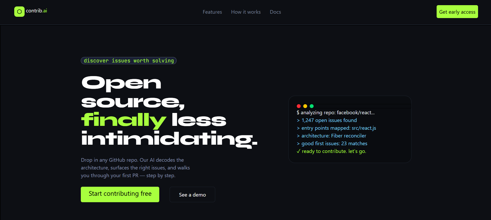
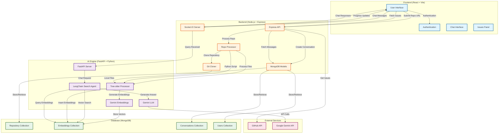

# contrib.ai

contrib.ai is a repo-aware assistant for open-source contributors. Paste a repository link, let the project process the codebase, and then ask questions about architecture, setup, contribution paths, and good first issues through a chat interface.

## Screenshots


### Landing Page



### Repository Link Flow


### Chatbot With Issues Panel


## Features

- Repository URL submission flow
- AI-powered chat interface for asking questions about a processed repo
- Conversation persistence by repository
- Real-time responses with Socket.IO
- Frontend issues panel with label filtering
- Dark, developer-focused UI built with React and Tailwind CSS
- Python AI engine for repository processing and semantic search

## Tech Stack

- Frontend: React, TypeScript, Vite, Tailwind CSS
- Backend: Node.js, Express, Socket.IO, MongoDB, Mongoose
- AI Engine: FastAPI, Google Gemini, PyMongo, Tree-sitter
- Database: MongoDB

## Architecture Diagram



## Workflow

### Repository Processing Flow
1. **User submits GitHub URL** → Frontend sends to Express API
2. **Backend creates job ID** → Stores in MongoDB (Repository collection)
3. **Git cloning** → Repository cloned to local storage
4. **Python environment setup** → Virtual environment created with dependencies
5. **Code parsing** → Tree-sitter parses code files (JS, TS, Python, JSX, TSX)
6. **Embedding generation** → Google Gemini API creates vector embeddings
7. **Vector storage** → Embeddings stored in MongoDB (code_agent database)
8. **Progress updates** → Socket.IO emits real-time progress to frontend

### Chat/Query Flow
1. **User asks question** → Frontend sends via Socket.IO
2. **Backend receives query** → Forwards to FastAPI AI engine
3. **Vector search** → LangChain performs semantic search in MongoDB
4. **Context retrieval** → Relevant code snippets retrieved based on embeddings
5. **AI response generation** → Gemini LLM generates answer using retrieved context
6. **Response delivery** → Answer sent back via Socket.IO to frontend
7. **Conversation persistence** → Messages stored in MongoDB (Conversations collection)

### Key Components
- **Frontend**: React + TypeScript + Vite + Tailwind CSS
- **Backend**: Node.js + Express + Socket.IO + Mongoose
- **AI Engine**: FastAPI + LangChain + Tree-sitter + Google Gemini
- **Database**: MongoDB (stores repos, embeddings, conversations, users)
- **Real-time**: Socket.IO for progress updates and chat
- **Parsing**: Tree-sitter for code structure analysis
- **Vector Search**: MongoDB Atlas Vector Search with Gemini embeddings

## Project Structure

```text
.
|-- ai_engine/        # FastAPI service and repo processing/search logic
|-- client/           # React + Vite frontend
|-- server/           # Express API and Socket.IO server
|-- scripts/          # Utility scripts
`-- README.md
```

## Getting Started

### Prerequisites

- Node.js
- Python 3.10+
- MongoDB connection string
- Gemini API key

### Environment Variables

Create environment files as needed for the backend and AI engine.

```env
MONGO_URI=your_mongodb_connection_string
GEMINI_KEY=your_gemini_api_key
```

## Installation

Install frontend dependencies:

```bash
cd client
npm install
```

Install backend dependencies:

```bash
cd server
npm install
```

Install AI engine dependencies:

```bash
cd ai_engine
pip install -r requirement.txt
```

## Running Locally

Start the backend server:

```bash
cd server
npm run dev
```

Start the AI engine:

```bash
cd ai_engine
uvicorn main:app --reload
```

Start the frontend:

```bash
cd client
npm run dev
```

By default, the Express server runs on port `8080`, and Vite will print the frontend URL in the terminal.

## Available Scripts

Frontend:

```bash
npm run dev
npm run build
npm run lint
npm run preview
```

Backend:

```bash
npm run dev
npm start
```

